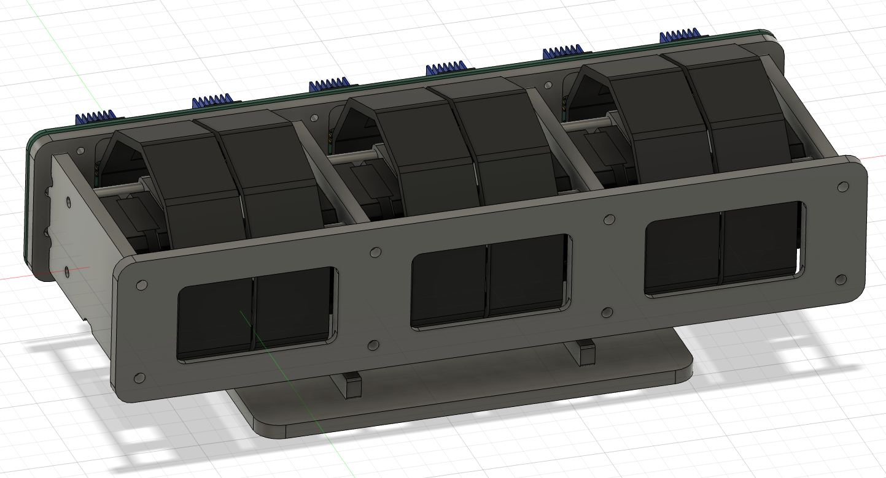
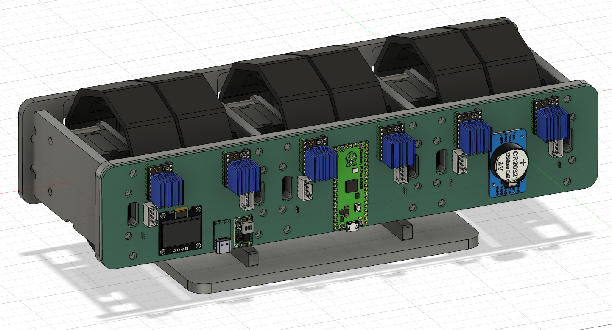
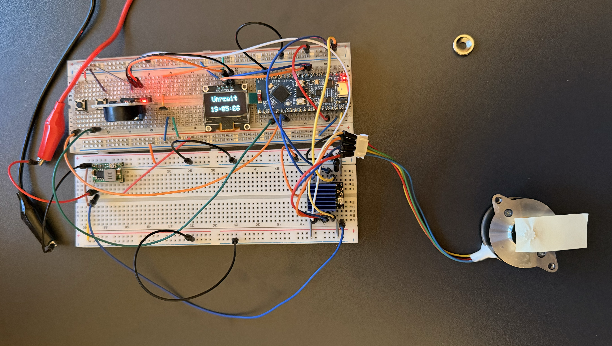

# 🕰️ Kinetic Digit Clock
 
A fully mechanical HH:MM:SS wall clock. Six independent stepper-driven digit wheels — one per character — each physically referenced by its own Hall sensor, driven by a custom PLC-style non-blocking control architecture running on an ESP32-S3.
 

 

<!-- Add your own build photos to an images/ folder to replace the placeholders above. -->
 
## 🚀 The Engineering Behind It
 
A digital clock is easy. Making six mechanical digit wheels land on the correct number, every second, forever, without ever losing sync — and without a single `delay()` blocking the other five — is the actual problem this project solves.
 
### Key Software Features:
* **Custom FB Architecture:** No Arduino sketch spaghetti — the whole clock is built from self-contained, non-blocking "function blocks" (`FB_Clock`, `FB_Motors`, ...) in an IEC-61131-3 / PLC-inspired style, each running its own internal step-chain and communicating only through small structs (`TimestampForMotors`, `TMCDriverStatus`). Same pattern as my other projects.
* **PLC-Style Utilities:** Like my other builds, timing and edge detection go through my own `Ton` (On-Delay) and `EdgePosNeg` classes instead of `delay()` or ad-hoc flags.
* **`StepperDriverModulo`:** A thin wrapper around `AccelStepper` that turns absolute angle targets (0–360°) into modulo-correct step counts, always moving forward through the shortest positive path — so a digit wheel never has to reverse to reach its next number.
* **Hardware Journey — UART vs. STEP/DIR:** Originally planned to run the TMC2209 drivers over single-wire UART for live diagnostics (StallGuard, temperature, connection status). After exhaustively ruling out wiring, addressing, and driver-hardware faults, UART was dropped in favor of plain STEP/DIR — microstepping is now set the old-fashioned way, via the MS1/MS2 legacy pins.
* **Microstep-Independent Motion:** Speed and acceleration are defined once as "1-full-step-equivalent" base values and scaled internally by the active microstepping factor, so the real-world angular speed/acceleration of a digit flip stays constant no matter which microstep resolution is wired up.
## 🛠️ Features
 
* **6 Independent Digit Wheels:** One stepper per HH:MM:SS digit, each running its own instance of the same control logic.
* **Self-Homing:** Every wheel finds its own zero position on a Hall sensor at startup before normal operation begins.
* **OLED + RTC Front-End:** Onboard real-time clock keeps time across power loss; an OLED display plus physical menu/setting buttons handle configuration.
* **Tunable Microstepping:** MS1/MS2-strapped resolution (currently 1/64) for quiet, precise motion, adjustable without touching the motion math.
* **Status Debugging:** Real-time serial tracking of every FB's internal state (`FB_Motors - Aktueller Schritt: 1000`), same convention as my other projects.
## 📁 Project Structure
 
* **src/main.cpp:** Instantiates all function blocks and wires them together each scan cycle.
* **src/app_config.h:** Centralized pin mapping and build-time configuration.
* **src/POUs/:** The function blocks themselves — `00_Clock` (RTC/time source), `01_Motors` (per-digit positioning), `_Comm` (driver communication).
* **src/DUT's/Interface/:** Shared data structures (`TimestampForMotors`, `TMCDriverStatus`) passed between function blocks.
* **lib/StepperDriverModulo/:** Custom modulo-aware positioning wrapper around `AccelStepper`.
## 🔧 Technical Stack
 
* **Controller:** ESP32-S3
* **Stepper Drivers:** TMC2209 (STEP/DIR mode, MS1/MS2 microstepping)
* **Motors:** NEMA steppers, 200 full steps/rev (1.8°), direct-drive — no gearbox
* **Position Feedback:** Hall-effect sensors (one per digit wheel, homing only)
* **RTC:** DS3231 (or equivalent I²C RTC)
* **Display:** I²C OLED
* **Framework:** Arduino / PlatformIO
* **Language:** C++ (Object-Oriented, PLC/IEC-61131-3-inspired)
---
*Developed as a personal project to build a real, physically moving clock the same disciplined, non-blocking way I'd structure an industrial PLC program.*
